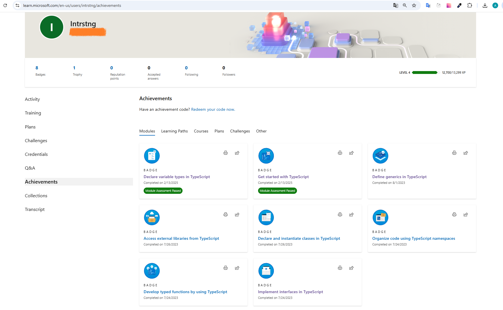

# My TypeScript Journey: Earned Badges 🏆

## Badges Overview

Here is a collection of badges I earned from completing Microsoft Learn's TypeScript modules:

1. **Getting Started with TypeScript**: [Badge](https://learn.microsoft.com/api/achievements/share/en-us/Intrstng/BTG59S7D?sharingId=C3CD0C30A48C6211)
2. **Declare Variable Types in TypeScript**: [Badge](https://learn.microsoft.com/api/achievements/share/en-us/Intrstng/HNRXZFS8?sharingId=C3CD0C30A48C6211)
3. **Implement Interfaces in TypeScript**: [Badge](https://learn.microsoft.com/api/achievements/share/en-us/Intrstng/DS6LBTCJ?sharingId=C3CD0C30A48C6211)
4. **Develop Typed Functions in TypeScript**: [Badge](https://learn.microsoft.com/api/achievements/share/en-us/Intrstng/ZM8HR8F2?sharingId=C3CD0C30A48C6211)
5. **Declare and Instantiate Classes in TypeScript**: [Badge](https://learn.microsoft.com/api/achievements/share/en-us/Intrstng/8FAXJ2PW?sharingId=C3CD0C30A48C6211)
6. **Generics in TypeScript**: [Badge](https://learn.microsoft.com/api/achievements/share/en-us/Intrstng/EKTDLBRP?sharingId=C3CD0C30A48C6211)
7. **Work with External Libraries in TypeScript**: [Badge](https://learn.microsoft.com/api/achievements/share/en-us/Intrstng/2QKPZMDV?sharingId=C3CD0C30A48C6211)
8. **Organize Code with Namespaces in TypeScript**: [Badge](https://learn.microsoft.com/api/achievements/share/en-us/Intrstng/KJLS4DLB?sharingId=C3CD0C30A48C6211)

### Learning path

**Build JavaScript applications using TypeScript**: [Badge](https://learn.microsoft.com/en-us/users/intrstng/achievements/ekje56vp)

## Screenshot:

## Reflections

1. **Getting Started with TypeScript**

* TypeScript is an enhanced version of JavaScript that introduces static typing to the language.
* This module provided me with foundational knowledge on how to begin using the TypeScript compiler. It covered the setup of the tsconfig.json file and introduced essential CLI commands for working with TypeScript.

2. **Declare Variable Types in TypeScript**

* This module has significantly improved my grasp of TypeScript by highlighting the value of static typing.
* Understanding variable types and their declarations is crucial for reducing bugs and improving code quality in development work.
* Enabling strict type checking helps avoid runtime issues by identifying type inconsistencies during the compilation phase.

3. **Implement Interfaces in TypeScript**

* In TypeScript, interfaces serve as a robust tool for defining the structure of objects. They enable you to enforce a contract in your code, ensuring that classes or objects follow a specific blueprint.
* This module has deepened my understanding of how interfaces can enhance code readability and maintainability. Implementing interfaces is essential for structuring code in a way that promotes reusability and type safety.
* When building complex applications, interfaces help define the structure of data being shared, ensuring uniformity across various components.

4. **Develop Typed Functions in TypeScript**

* In TypeScript, developing typed functions allows you to specify the types of parameters and return values, enhancing code clarity and reducing potential errors. Typed functions are crucial in ensuring that the right types are passed to functions, which minimizes bugs and enhances maintainability.
* This module has improved my understanding of how typed functions contribute to writing safer and more predictable code. By specifying parameter and return types, I learned to identify errors during compilation rather than at runtime.

5. **Declare and Instantiate Classes in TypeScript**

* In TypeScript, classes provide a way to encapsulate data and functionality, enabling object-oriented programming.
* This module improved my understanding of how to effectively use classes in TypeScript. I learned about class properties, constructors, and methods, which together provide a clear structure for creating reusable components. Additionally, understanding access modifiers like public, private, and protected has helped me grasp how to control visibility and encapsulate functionality within classes.

6. **Generics in TypeScript**

* Generics in TypeScript allow you to create reusable components that can work with any data type while maintaining type safety.
* Generics are crucial for developing scalable applications, as they allow developers to write more abstract and reusable code.
* Through the use of generics, I learned how to create functions and classes that can handle various data types while ensuring type safety.

7. **Work with External Libraries in TypeScript**

* This module expanded my knowledge of how to effectively integrate and utilize external libraries within TypeScript projects.
* Understanding how to correctly import and utilize these libraries ensures that my code remains clean and efficient. It also allows for better collaboration, as team members can rely on consistent and type-safe implementations of shared functionality.

8. **Organize Code with Namespaces in TypeScript**

* Namespaces in TypeScript offer a way to group related code, helping to prevent naming conflicts and organize larger projects. They act as a logical container for variables, functions, and classes, simplifying code management and maintenance.
* This module helped me understand how namespaces can be used to logically structure code. By grouping related functions, I can create a clearer separation of concerns in my application.